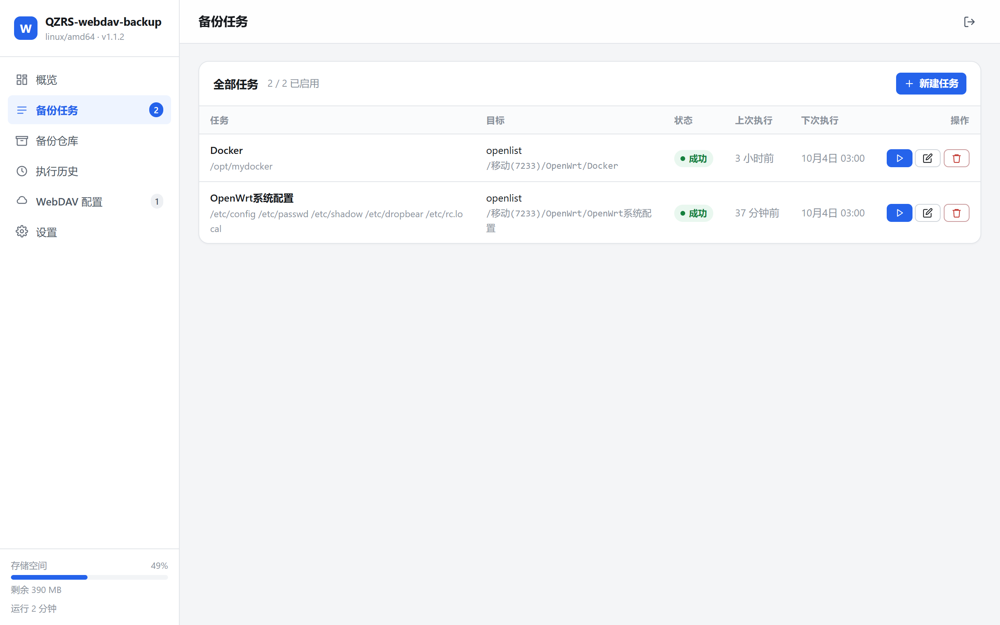

# QZRS-webdav-backup（WebDAV 备份）

一个为路由器与小型 Linux 主机设计的轻量文件备份工具：
把设备上的配置和指定目录打包上传到任意 WebDAV 服务，也能随时拉回来恢复，
全部通过内置的 Web 控制台管理。

单个静态二进制，无运行时依赖，适合 ROM 空间和内存都紧张的路由器，
同样可以直接跑在任意 Linux 发行版（Debian / Ubuntu / Alpine / NAS 系统等）上。



---

## 支持平台

| `uname -m` 输出 | 对应包 | 典型设备 |
|---|---|---|
| `x86_64` | `linux-amd64` | N100/J4125 软路由、NAS、VPS、大多数 PC |
| `aarch64` | `linux-arm64` | R2S/R4S、树莓派 4/5、ARM 服务器 |
| `armv7l` | `linux-arm-v7` | 老款 ARM 设备 |
| `mips` / `mipsel` | `linux-mips` / `linux-mipsle` | MT7621 等低配路由器 |

OpenWrt / ImmortalWrt 提供 procd 开机自启脚本；其他发行版提供 systemd 配置示例（见下文）。

## 主要特性

**备份**

- 多路径打包，支持包含 / 排除通配符（`*.log`、`etc/config/**`、`**` 等）
- gzip 压缩（可选不压缩），gzip 级别可调
- 可选「流式上传」——边打包边上传，不占本地暂存空间
- 可选「不跨文件系统」，避免顺着一棵目录把整块硬盘拖进来
- 归档内保留完整路径结构，恢复到 `/` 即可原地还原系统配置
- 每个归档自带清单文件，记录创建时间、来源主机、原始路径与文件数
- 保留策略：自动删除远端最旧的归档，只留最近 N 个

**恢复**

- 从远端归档列表直接挑选并恢复
- 恢复前可预览归档内容与清单
- 支持「试运行」——只列出将要写入的内容，不碰文件系统
- 支持「仅校验」——只下载校验归档完整性
- 支持 `strip-components` 去掉前 N 层路径
- 提取时防护路径穿越（zip-slip），归档内的恶意路径会被拒绝

**调度**

- cron 表达式（五段式：分 时 日 月 周）或固定间隔
- 界面内实时预览接下来的执行时间
- 同一任务不会并发执行，上一次没跑完会跳过本次触发

**运行**

- Web 控制台单页应用，已内嵌进二进制，无额外静态文件
- 单用户密码认证（PBKDF2-HMAC-SHA256，12 万次迭代）
- WebDAV 密码以 AES-256-GCM 加密存储，配置文件权限 0600
- 登录失败限速，防暴力破解
- 每次执行的完整日志，界面内可实时查看进度
- 适配手机浏览器
- 内置 `-dav-probe` 连接诊断，逐条探测并解释失败原因，全程只读

---

## 快速开始（OpenWrt / ImmortalWrt）

### 1. 确认设备架构

```sh
ssh root@192.168.11.1
uname -m
```

对照上面的「支持平台」表选出对应的包。

### 2. 上传并安装

```sh
# 在开发机上，替换为实际的文件名与路由器地址
scp qzrs-webdav-backup-1.1.0-linux-amd64.tar.gz root@192.168.11.1:/tmp/

ssh root@192.168.11.1
mkdir -p /tmp/wdb && cd /tmp/wdb
tar -xzf /tmp/qzrs-webdav-backup-1.1.0-linux-amd64.tar.gz
./install.sh
```

安装脚本会：

1. 停止可能正在运行的旧版本
2. 把二进制装到 `/usr/bin/qzrs-webdav-backup`
3. 把服务脚本装到 `/etc/init.d/qzrs-webdav-backup`
4. 创建 `/etc/config/qzrs-webdav-backup`（UCI 配置）
5. 设置开机自启并启动服务
6. 首次安装时从日志中读出初始密码并打印

安装结束后终端会直接给出访问地址和初始密码：

```
===============================================
 安装完成 — 登录信息

   访问地址 : http://192.168.11.1:8787/
   用户名   : admin
   初始密码 : admin

 初始密码为默认值 admin，登录后请立即在「设置」中修改。
===============================================
```

### 3. 打开控制台

浏览器访问 `http://<路由器IP>:8787/`，用上面的账号登录。

---

## 快速开始（其他 Linux 发行版）

### 1. 直接运行

```sh
tar -xzf qzrs-webdav-backup-1.1.0-linux-amd64.tar.gz
sudo install -m 755 qzrs-webdav-backup /usr/local/bin/qzrs-webdav-backup

sudo mkdir -p /var/lib/qzrs-webdav-backup
qzrs-webdav-backup -data /var/lib/qzrs-webdav-backup -listen 0.0.0.0:8787
```

首次启动会在日志里打印初始管理员密码（`admin`）：

```sh
grep -A3 '已创建默认管理账号' /var/lib/qzrs-webdav-backup/service.log
```

浏览器访问 `http://<主机IP>:8787/` 即可。

### 2. systemd 开机自启

```ini
# /etc/systemd/system/qzrs-webdav-backup.service
[Unit]
Description=WebDAV Backup Console
After=network-online.target
Wants=network-online.target

[Service]
ExecStart=/usr/local/bin/qzrs-webdav-backup -data /var/lib/qzrs-webdav-backup -listen 0.0.0.0:8787
Restart=on-failure
RestartSec=5

# 加固（按需启用）
# User=backup
# ReadWritePaths=/var/lib/qzrs-webdav-backup
# ProtectSystem=strict

[Install]
WantedBy=multi-user.target
```

```sh
sudo systemctl daemon-reload
sudo systemctl enable --now qzrs-webdav-backup
```

> 需要备份 `/etc` 等系统目录时，服务需要以 root 运行（保持默认即可）。
> 常用参数：`-data <目录>` 数据与配置位置、`-listen <地址:端口>` 监听地址、
> `-reset-password` / `-set-password <密码>` 重置控制台密码、
> `-dav-probe <URL>` 连接诊断（见下文）。

---

## 使用流程

### 第一步：添加 WebDAV 配置

进入「WebDAV 配置」→「添加配置」。填写远端服务地址、账号、密码，
点「测试连接」确认能通再保存。

常见服务的地址写法：

| 服务 | 地址格式 |
|---|---|
| 坚果云 | `https://dav.jianguoyun.com/dav/` |
| Nextcloud | `https://cloud.example.com/remote.php/dav/files/<用户名>/` |
| Alist / OpenList | `http://192.168.1.10:5244/dav` |
| 群晖 WebDAV Server | `http://192.168.1.20:5005/` |
| 威联通 | `http://192.168.1.30:8080/` |

> 坚果云等需要使用「应用密码」，不是登录密码。
> 自签名证书的内网服务可以勾选「跳过 TLS 证书校验」。
>
> **Alist / OpenList 聚合挂载注意**：往聚合根（`/dav`）下创建目录时，部分网盘
> 驱动会返回成功但目录实际不创建；个别驱动不接受 WebDAV 上传。备份目标目录
> 建议选在确认可写的网盘内，并用「测试连接」核对返回的条目列表。

### 第二步：创建备份任务

「备份任务」→「新建任务」。

**备份内容** — 至少要有一个源路径。界面提供了几个常用预设，也可以点
「浏览」挑选目录，或直接手输路径。

**排除规则**，几个例子：

| 写法 | 含义 |
|---|---|
| `*.log` | 排除任意层级的 `.log` 文件 |
| `node_modules` | 排除任意层级的 `node_modules` 目录 |
| `etc/config/network` | 精确排除一个文件（从归档根开始匹配） |
| `mnt/data/**` | 排除整个子树 |
| `backup-?.tar` | `?` 匹配单个字符 |

> 注意：排除模式匹配的是**归档内的完整路径**（源路径去掉开头斜杠后的样子），
> 不是相对某一个源路径。例如源路径是 `/opt/`、想排除 Docker 镜像层时，
> 要写 `opt/docker/overlay2/` 而不是 `docker/overlay2/`。

**执行计划** — 选「仅手动」就只在点按钮时执行；选「固定间隔」按小时/天循环；
选「cron 表达式」可精确到分钟，界面会实时显示接下来几次的执行时间。

**压缩与保留** — 保留版本数填 `7` 表示远端最多留 7 个归档，超出的自动删除。
填 `0` 表示不限制（注意远端空间）。

**本地暂存目录** — 打包时临时文件的存放位置。OpenWrt 的 `/etc` 通常在
容量有限的 overlay 分区上，如果要备份几百 MB 以上的数据，建议指向大容量
挂载点：

```sh
mkdir -p /opt/qzrs-webdav-backup/tmp
```

然后在任务或全局设置里把暂存目录设为 `/opt/qzrs-webdav-backup/tmp`。

如果本地实在没有空间，可以打开「流式上传」——边打包边上传，不落盘。
但它要求远端服务端接受没有 `Content-Length` 的 PUT 请求，部分服务会拒绝；
遇到失败就关掉这个选项。

**备份 Docker 数据的建议**：Docker 镜像层（`/var/lib/docker/overlay2` 或
`/opt/docker/overlay2`）有几十 GB 且可由镜像随时重建，**不要**把它打进备份；
值得备份的是 volumes、bind mount 的配置目录和 `containerd` 之外的自有数据。
源路径是 `/opt/` 时，在「排除」里加上 `opt/docker/overlay2/` 即可。

### 第三步：执行与查看

任务列表里点 ▶ 立即执行。执行中可以点任务或进「执行历史」查看实时日志，
日志会显示连接、打包、上传、清理每个阶段的进展和统计：

```
2026-10-02 03:00:01  === 备份任务开始：OpenWrt 配置 (a1b2c3) ===
2026-10-02 03:00:01  远端：https://dav.example.com/dav/  目录：/router
2026-10-02 03:00:01  [1/5] 测试 WebDAV 连接 ...
2026-10-02 03:00:02        连接正常，认证通过
2026-10-02 03:00:02  [2/5] 确保远端目录存在：/router
2026-10-02 03:00:03  [3/5] 打包到本地暂存：/opt/qzrs-webdav-backup/tmp/...
2026-10-02 03:00:05        打包完成：1842 个文件 / 213 个目录，原始 12.4 MB → 压缩 3.1 MB（25%）
2026-10-02 03:00:06  [4/5] 上传到 /router/OpenWrt_配置-20261002-030001123.tar.gz ...
2026-10-02 03:00:09        上传完成：3.1 MB，用时 3s（1.03 MB/s）
2026-10-02 03:00:09        校验通过：远端文件大小一致
2026-10-02 03:00:10  [5/5] 应用保留策略 ...
2026-10-02 03:00:10        远端已有 8 个本任务的备份，保留最新 7 个
2026-10-02 03:00:10        已删除旧备份：OpenWrt_配置-20260925-030001088.tar.gz（3.0 MB）
2026-10-02 03:00:10  === 结束：成功  用时 9s ===
```

### 第四步：恢复

「备份仓库」→ 选择配置 → 「列出归档」→ 在目标归档上点「预览」或「恢复」。

**推荐的安全流程**：

1. 点「预览」确认归档内容和来源主机是否正确
2. 在恢复对话框里把目标目录设为一个临时目录（如 `/tmp/restore-test`），
   勾选「试运行」，执行——这样只列出会写入什么，不改动任何文件
3. 确认无误后，把目标目录改成 `/`，取消「试运行」，正式恢复

关掉「覆盖已存在的文件」时，同名文件会被跳过而不是覆盖。

---

## 服务管理

### OpenWrt（procd）

```sh
/etc/init.d/qzrs-webdav-backup status      # 状态
/etc/init.d/qzrs-webdav-backup restart     # 重启
/etc/init.d/qzrs-webdav-backup stop        # 停止
logread | grep qzrs-webdav-backup          # 系统日志
tail -f /etc/qzrs-webdav-backup/service.log
```

修改监听端口：

```sh
uci set qzrs-webdav-backup.main.listen='0.0.0.0:9000'
uci commit qzrs-webdav-backup
/etc/init.d/qzrs-webdav-backup restart
```

### 其他 Linux（systemd）

```sh
systemctl status qzrs-webdav-backup
sudo systemctl restart qzrs-webdav-backup
journalctl -u qzrs-webdav-backup -f
```

### 忘记密码

重置为一个新的随机密码（会打印出来）：

```sh
qzrs-webdav-backup -data /etc/qzrs-webdav-backup -reset-password
/etc/init.d/qzrs-webdav-backup restart
```

或者指定自己的密码：

```sh
qzrs-webdav-backup -data /etc/qzrs-webdav-backup -set-password '你的新密码'
/etc/init.d/qzrs-webdav-backup restart
```

### 诊断 WebDAV 连接

控制台的「测试连接」只会把服务端返回的原始状态码转述出来。要在设备上进一步定位，
用内置的诊断模式，它会逐条探测并给出结论：

```sh
qzrs-webdav-backup -dav-probe 'https://dav.jianguoyun.com/dav/' \
    -dav-user 'you@example.com' -dav-pass '应用密码'
```

输出示例：

```
[1/3] OPTIONS 集合根
    OPTIONS https://dav.jianguoyun.com/dav/
        → HTTP 405 Method Not Allowed
          Allow: GET, HEAD
          Server: nginx
[2/3] PROPFIND Depth:0 集合根
    ...
  结论：无法使用 ✗
  服务端不接受 PROPFIND（405）。三种可能：……
```

它依次发起 `OPTIONS`、`PROPFIND Depth:0`、`PROPFIND Depth:1`，打印每一步的
HTTP 状态与 `Allow` / `DAV` / `Server` 响应头。**全程只读**，不会创建、修改或
删除远端任何数据，可以直接对着生产账号跑。

密码不想留在命令历史里时改用环境变量：

```sh
WDB_DAV_PASSWORD='应用密码' qzrs-webdav-backup -dav-probe 'https://host/dav/' -dav-user 'you@example.com'
```

其他参数：`-dav-dir <子目录>` 顺便列出该目录的条目数与归档大小、`-dav-insecure`
跳过证书校验、`-dav-timeout <秒>` 调整超时（默认 20 秒）。

### 卸载（OpenWrt）

```sh
./uninstall.sh          # 移除程序，保留配置与数据
./uninstall.sh -p       # 连数据目录一起删除
```

---

## 目录结构

| 路径 | 内容 |
|---|---|
| `/usr/bin/qzrs-webdav-backup` | 程序二进制 |
| `/etc/init.d/qzrs-webdav-backup` | procd 服务脚本 |
| `/etc/config/qzrs-webdav-backup` | UCI 配置（启用状态、数据目录、监听地址） |
| `/etc/qzrs-webdav-backup/config.json` | 主配置：账号、WebDAV 档案、备份任务 |
| `/etc/qzrs-webdav-backup/service.log` | 服务运行日志 |
| `/etc/qzrs-webdav-backup/state/runs/` | 每次执行的记录（JSON） |
| `/etc/qzrs-webdav-backup/state/logs/` | 每次执行的日志 |
| `/etc/qzrs-webdav-backup/tmp/` | 打包默认暂存目录 |

`config.json` 权限为 `0600`，其中 WebDAV 密码以 AES-256-GCM 加密存储。
文件的加密密钥保存在同一个文件里，因此它是**防泄漏混淆**，不是对
能完整读取磁盘的攻击者的防护。请勿公开分享该文件。

---

## 从源码构建

需要 Go 1.24 或更高版本。

```sh
# 构建全部平台（含测试与 vet）
sh deploy/build.sh

# 只构建指定平台
sh deploy/build.sh linux/amd64
```

产物在 `dist/` 目录，每个架构一个 `.tar.gz`，内含二进制、安装脚本与文档。
构建脚本会先跑测试和 `go vet`，任何一项不过就中止，避免发布未验证的产物。

两点已知的打包注意事项：

- tar 包的权限位由 `scripts/pack.py` 显式写入——Windows 上的 `chmod +x` 与
  `tar --mode=0755` 都无法把执行位写进 tar 头，手工打包会得到不可执行的二进制。
- 在 Windows 本机构建 **Windows PE** 调试版时，不要加 `-ldflags "-s -w"`：
  剥符号的 PE 会被部分杀软（如火绒）误判为 `HEUR:VirTool/Obfuscator.a` 并在
  落盘后立即删除，`go build` 退出码却为 0。Linux ELF 目标不受影响。

### 开发

```sh
# 运行所有测试
go test ./...

# 在本机直接跑起来（数据目录放在当前目录下）
go run . -data ./devdata -listen 127.0.0.1:8787
```

项目结构：

```
main.go                     程序入口、参数解析、首次运行引导
internal/config/            配置模型与原子持久化
internal/cryptoutil/        PBKDF2 口令哈希、AES-GCM 加解密
internal/dav/               自研 WebDAV 客户端（PROPFIND/PUT/GET/MKCOL/DELETE）
internal/archive/           tar.gz 打包与解包、通配符匹配、zip-slip 防护
internal/engine/            备份与恢复执行引擎、执行历史
internal/scheduler/         cron 调度
internal/api/               HTTP 接口与认证
internal/testdav/           测试用的最小 WebDAV 服务端
web/                        控制台前端（编译期嵌入二进制）
deploy/                     部署脚本
```

外部依赖只有一个：`github.com/robfig/cron/v3`。其余全部使用标准库，
包括 WebDAV 客户端和口令哈希，因此交叉编译不会因为上游库而意外失败。

---

## 故障排查

**服务起不来**

```sh
logread | grep qzrs-webdav-backup | tail -30      # OpenWrt
journalctl -u qzrs-webdav-backup -n 30            # systemd
cat /etc/qzrs-webdav-backup/service.log
```

常见原因：端口被占用（改 `listen`）、数据目录不可写、架构不匹配。

**提示 `登录尝试过于频繁，请在 XmXXs 后重试`**

连续输错 8 次密码，会在 10 分钟窗口内锁定该来源 IP 5 分钟。锁定记录只存在内存
里，重启服务立刻清除：

```sh
/etc/init.d/qzrs-webdav-backup restart
```

首次启动生成的密码只在安装时打印一次，同时也写进服务日志，事后可以捞出来：

```sh
grep -A3 '已创建默认管理账号' /etc/qzrs-webdav-backup/service.log
```

注意：**卸载并重装会重新生成密码**。若用 `uninstall.sh -p` 删除过数据目录，
之前记下的密码就失效了，需要用上面的方法重新查，或直接重置（见「忘记密码」）。

**测试连接失败，提示 `dav: PROPFIND /: HTTP 405 Method Not Allowed`**

这不是本程序的缺陷，而是服务端或中间代理拒绝了 `PROPFIND`。按可能性从高到低：

1. **URL 没有指向 WebDAV 根目录**。各家前缀不一样，常见的有 `/dav/`、
   `/webdav/`、`/remote.php/dav/files/<用户名>/`。填成网盘首页地址必然 405。
2. **集合路径缺结尾斜杠**。本程序会对集合路径自动补 `/`，并在被拒时自动回退
   重试；若两种形式都被拒绝，说明问题不在这里。
3. **前面隔着只放行 GET/POST 的反向代理或 CDN**。CDN 默认不转发 WebDAV 方法，
   典型表现就是 405，诊断输出里的 `Server` 响应头能直接看出中间有谁。
   解决办法是让该域名绕过 CDN，或让代理放行 `PROPFIND`/`MKCOL`/`PUT`/`DELETE`
   并转发 `Depth` 请求头。

定位用内置的诊断模式，它会逐条探测并直接给出结论（详见
「诊断 WebDAV 连接」）。

**安装时报「二进制没有执行权限」**

文件经 Windows 侧中转或从 zip 解包后会丢失执行位，`install.sh` 会自动
`chmod +x` 修复。若脚本提示自动修复失败，手动执行一次即可：

```sh
chmod +x qzrs-webdav-backup && ./install.sh
```

**安装时报「格式与当前设备不匹配」**

这才是真正的架构不符。先确认设备架构，再取对应的包（见「支持平台」）。

**打开控制台一直显示「正在载入控制台…」**

说明页面脚本没有跑起来。页面在 8 秒后会自行给出原因提示和「重新加载」按钮，
也可以按下面的顺序直接排查：

1. **强制刷新**：Windows `Ctrl+F5`，Mac `Cmd+Shift+R`。
   控制台外壳与静态资源都不做长缓存，刷新后即可拿到与当前版本匹配的脚本。
2. **按 F12 打开 Console**：若报 `Uncaught SyntaxError`，说明浏览器版本过旧。
   前端用到可选链等较新语法，请使用 Chrome / Edge / Firefox 近两年的版本。
3. 直接访问 `http://<设备IP>:8787/app.js`，确认能下载到脚本且没有被中间的反向代理
   改写 `Content-Type`（必须是 `text/javascript`，否则浏览器会拒绝执行）。

**连接 WebDAV 失败**

先在界面上用「测试连接」。错误信息会指出具体原因：

| 提示 | 含义与处理 |
|---|---|
| `HTTP 401` | 账号或密码错误。坚果云等要用应用密码 |
| `HTTP 403` | 服务端拒绝该路径，检查地址前缀与账号权限 |
| `HTTP 409` | 父目录不存在（通常会自动创建，出现即服务端行为特殊） |
| `HTTP 507` | 远端配额已满 |
| `HTTP 411` | 服务端要求 Content-Length，请关闭任务的「流式上传」 |
| `certificate` | 证书校验失败。自签名证书请勾选「跳过 TLS 证书校验」 |
| `timed out` | 网络不通或超时太短，可调大配置里的超时秒数 |

**备份失败：提示目录创建成功但随后查询不到**

服务端（常见于 Alist/OpenList 的部分网盘驱动）对创建目录返回了成功但没有真正
执行。程序会在打包之前就发现并报错。处理：换一个确认可写的网盘/存储空间作为
目标目录，或在该服务的管理界面确认存储驱动的写权限。

**备份成功但远端没文件**

检查任务里的「远端目录」，以及 WebDAV 地址的前缀是否正确。
有些服务（如 Nextcloud）路径前缀必须完整，否则文件会落到意料之外的位置。

**提示本地空间不足**

把全局或任务的「本地暂存目录」指向大容量分区，或打开「流式上传」。
备份 Docker 数据时同时确认已排除 `overlay2` 镜像层（见上文「使用流程」）。

**任务没按计划执行**

同一条记录的触发方式显示为「手动」说明调度没生效。检查服务状态
（`/etc/init.d/qzrs-webdav-backup status` 或 `systemctl status qzrs-webdav-backup`），
在任务编辑页确认调度方式不是「仅手动」，并且 cron 表达式预览有输出。
任务被停用（「启用此任务」未勾选）时也不会自动执行。

---

## 安全说明

- 控制台默认监听 `0.0.0.0:8787`，即对局域网开放。**请勿直接暴露到公网。**
  需要远程访问时，建议通过 VPN（WireGuard / Tailscale）或加了 HTTPS 的
  反向代理，并在设置中启用「信任 X-Forwarded-For」。
- 密码使用 PBKDF2-HMAC-SHA256（12 万次迭代）哈希，比对为常数时间。
- 会话保存在内存中，重启服务会登出所有设备。
- 登录失败 8 次后，该来源地址会被锁定 5 分钟。
- 修改密码后，除当前浏览器外的其余会话立即失效。
- 恢复操作会写入本机文件系统，且以 root 运行——执行前请务必用「试运行」确认。

---

## 更新日志

### 1.1.3（2026-10-03）

- 通知新增 **Gotify** 格式（自建推送）：地址填服务器根地址、应用令牌填在
  「附加参数」栏，或直接填完整的 `/message?token=…` 地址；失败通知使用高优先级
- 新增通知负载单元测试（各格式的端点与载荷断言）

### 1.1.2（2026-10-03）

**任务通知**

- 新增完成通知 webhook，四种推送格式：Bark（iOS）、Telegram Bot、企业微信机器人、
  通用 JSON；成功/失败可分别开关（默认仅失败通知），在「设置 → 任务通知」配置
- 通知为后台尽力投递（15 秒超时），失败只记日志，绝不影响任务本身

**执行历史**

- 新增「清除全部」按钮（带二次确认；有任务执行中时服务端拒绝清除）
- 修正设置页密码长度提示与实际校验不一致（8 位 → 5 位）

### 1.1.1（2026-10-03）

**上传可靠性**

- 上传后自动「回读校验」：Range 读回归档头 16 字节并比对文件签名，
  网盘驱动「假成功」（HTTP 201 但文件未真正落盘，实测于移动云盘）不再蒙混过关
- 大小校验无法执行时不再静默跳过，明确写入运行日志
- 暂存目录空间预检：可用空间不足 64MB 直接报错并提示改暂存目录，
  不足 512MB 提前警告（对应 overlay 小分区打包到一半 ENOSPC 的坑）
- 元数据请求（PROPFIND/STAT/MKCOL）超时与上传超时分离，封顶 2 分钟：
  为大文件上传调大超时后，服务端卡死不再拖住所有元数据操作一小时

**构建**

- 新增 GitHub Actions：打 tag（`v*`）自动跑五步门禁并构建五架构发布包挂 Release

### 1.1.0（2026-10-03）

**更名与默认账号**

- 项目更名为 **QZRS-webdav-backup**：命令、服务名、UCI 配置、数据目录统一加
  `qzrs-` 前缀（`/usr/bin/qzrs-webdav-backup`、`/etc/init.d/qzrs-webdav-backup`、
  `/etc/qzrs-webdav-backup`）。安装脚本自动迁移旧版数据目录并清理旧服务，
  升级式安装不丢配置、任务与历史
- 默认管理账号改为 **admin / admin**，安装完成即显示；登录后请立即修改
- 修改密码的最小长度放宽到 5 个字符（原 8 个）

**Web 控制台**

- 修复运行详情页「终止任务」按钮在轮询重绘后失效：重绘一轮后按钮不再响应，
  终止请求从未发出；点击后按钮转为禁用态「终止中…」

### 1.0.1（2026-10-02）

**WebDAV 客户端与引擎**

- 集合请求自动携带结尾斜杠并在被拒时回退重试，适配 nginx/Apache location 块
- `OPTIONS` 探测失败自动回退 `PROPFIND`，不再把代理拦截误报为服务器故障
- 创建远端目录后逐级验证真实存在：服务端谎报成功（Alist/OpenList 部分驱动）时
  立即报错，而不是等到上传才 404
- 档案 URL 指向的目录不存在时，备份在开始前给出可操作的报错
- 备份/恢复失败的完整原因写入运行日志
- 新增 `-dav-probe` 只读连接诊断与 `internal/testdav` 测试服务端

**Web 控制台**

- 修复「新建/编辑任务」「运行详情」三类入口点击无反应（hash 路由解析错误）
- 修复有任务运行时任务编辑页每 2.5 秒被重绘：填了一半的表单被清空、目录选择器
  选完路径不回填
- 修复编辑已有任务时源路径/包含/排除列表不显示
- 修复启动提示与界面同屏显示
- 「测试连接」现在返回远端条目列表（标注目录/文件），可直接核对目标位置
- 登录相关文案：点明用户名与密码找回方法

### 1.0.0（2026-09）

首个公开发布版本。

---

## 许可证

MIT
